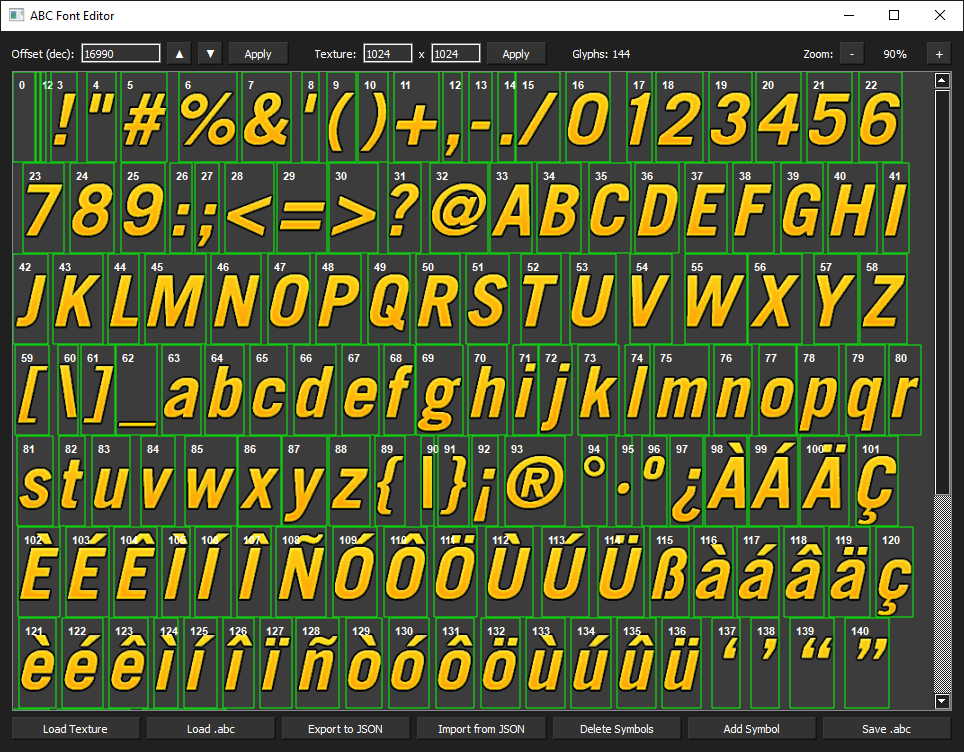

# ABC Font Editor
### A desktop GUI tool for viewing and editing `.abc` binary font files from the FlatOut game series (FlatOut, FlatOut 2, FlatOut: Ultimate Carnage, FlatOut: Head On).

## Features
- Load and visualize `.abc` font files alongside their texture atlases (`.png` and supported `.dds` formats), with glyph rectangles drawn directly over the texture
- Double-click any glyph on the texture preview to edit its coordinates and metrics
- Export glyph tables to JSON with:
  - UV or pixel coordinates
  - Character mappings
  - Unicode codepoints
  - Padding and width metrics
  - Global/header parameters (WIP)
- Import edited JSON data back into memory and save as a new `.abc` file
- Add new glyphs and symbols by:
  - Character
  - Unicode notation (`U+XXXX`)
  - Hexadecimal values (`0xXXXX`)
  - Decimal codepoints
- Delete symbols or glyph indexes with automatic:
  - Charmap rebuilding
  - Glyph index remapping
  - Glyph table cleanup
  - Header updates
- Configurable texture resolution for correct pixel coordinate calculation even without a texture file
- Zoom support from 10% to 300%
- Glyph index overlay visualization directly on the texture
- All modifications are applied in memory until **Save .abc** is used

<p align="center">
  
</p>

## Requirements
- Python 3.x
- PyQt5
- Pillow

## Installation
```bash
pip install PyQt5 Pillow
```
## Usage
```bash
python abc_font_editor.py
```

## Usage Examples
1. Viewing a font file
    1. Click **Load Texture** and open the font texture (example: `hud_numbers.dds`)
    2. Click **Load .abc** and open the matching font file (example: `hud_numbers.abc`)
    3. Green rectangles will appear on the texture, each marking a glyph position
    4. The glyph index is displayed in the top-left corner of each rectangle

2. Editing glyphs directly
    1. Load a texture and `.abc` file
    2. Double-click any glyph rectangle on the preview
    3. Edit:
       - Pixel coordinates
       - UV coordinates
       - Padding
       - Glyph width
       - Cell width
       - Unknown data field
    4. Confirm the changes
    5. Click **Save .abc** to write changes to disk
   


3. Exporting glyph data to JSON
   1. Load the `.abc` file (texture optional)
   2. Click **Export to JSON**
   3. Choose export format:
      - UV coordinates (0.0–1.0)
      - Pixel coordinates
   4. Save the `.json` file

Example exported glyph entry:
```json
{
    "index": 5,
    "chars": ["A"],
    "codepoints": [65],
    "px_x_start": 12,
    "px_y_start": 0,
    "px_x_end": 28,
    "px_y_end": 32,
    "padding_left": 1,
    "glyph_width": 15,
    "cell_width": 17
}
```

4. Importing edited glyphs
    1. Edit the exported `.json` file
    2. Click **Import from JSON**
    3. Select the modified JSON file
    4. Click **Save .abc** to write changes to disk

5. Adding a new symbol
    1. Load an `.abc` file
    2. Click **Add Symbol**
    3. Enter:
       - Character or codepoint (`Ж`, `U+0416`, `0x416`, etc.)
       - Source glyph index to copy
       - Optional coordinates and metrics
    4. Confirm the operation
    5. Click **Save .abc**

6. Deleting symbols or glyph indexes
    1. Load an `.abc` file
    2. Click **Delete Symbols**
    3. Enter characters, codepoints, or glyph indexes
    Supported formats:
       - Characters:
         `A B C`
       - Unicode:
         `U+0041 U+0042`
       - Hexadecimal:
         `0x41 0x42`
       - Ranges:
        ` A-Z
         U+0410-U+042F`
       - Glyph indexes:
         `12 15 20-30`
    4. Confirm deletion
    5. The program automatically rebuilds the glyph table and charmap
    6. Click **Save .abc**

7. Working without a texture
If the texture file is unavailable
    1. Load the `.abc` file only
    2. Enter the correct texture resolution manually (example: `512 x 512`)
    3. Click **Apply**
    4. Pixel coordinate conversion and JSON export/import will still work correctly

## Notes
- Glyph index `0` is protected and cannot be deleted
- Changes are stored in memory until explicitly saved
- `.dds` loading depends on Pillow DDS support
